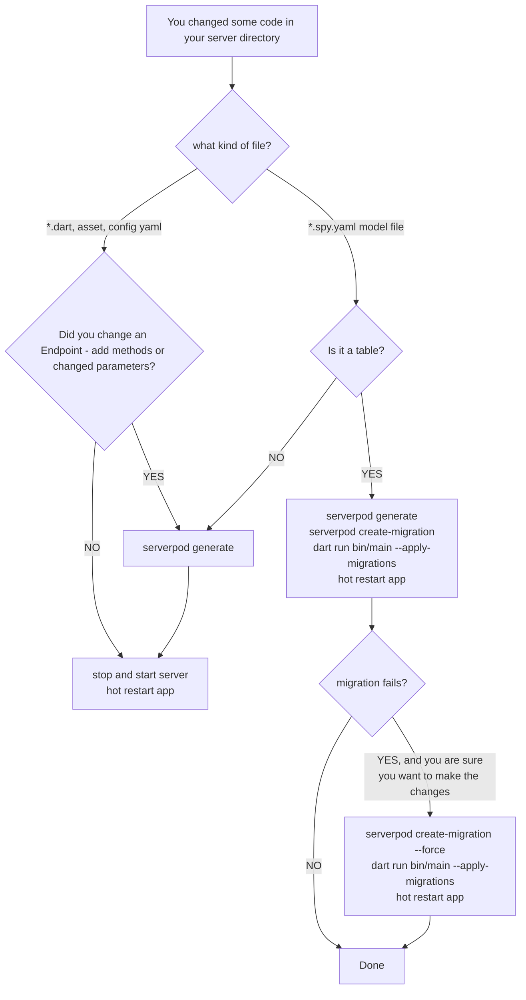

```mermaid
flowchart TD
    A[You changed some code in your server directory] --> B{what kind of file?}
    B -- "*.dart, asset, config yaml" --> C{Did you change an Endpoint - add methods or changed parameters?}
    B -- "*.spy.yaml model file" --> D{Is it a table?}
    C -- NO --> E[stop and start server<br>hot restart app]
    C -- YES --> F[serverpod generate]
    D -- NO --> F
    D -- YES --> G[serverpod generate<br>serverpod create-migration<br>dart run bin/main --apply-migrations<br>hot restart app]
    G --> H{migration fails?}
    H -- NO --> I[Done]
    H -- YES, and you are sure<br>you want to make the changes --> J[serverpod create-migration --force<br>dart run bin/main --apply-migrations<br>hot restart app]
    J --> I
    F --> E
```
